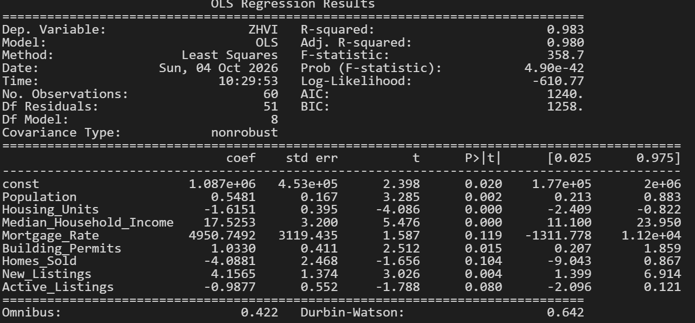
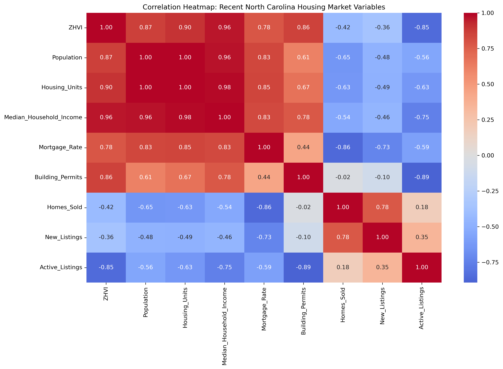
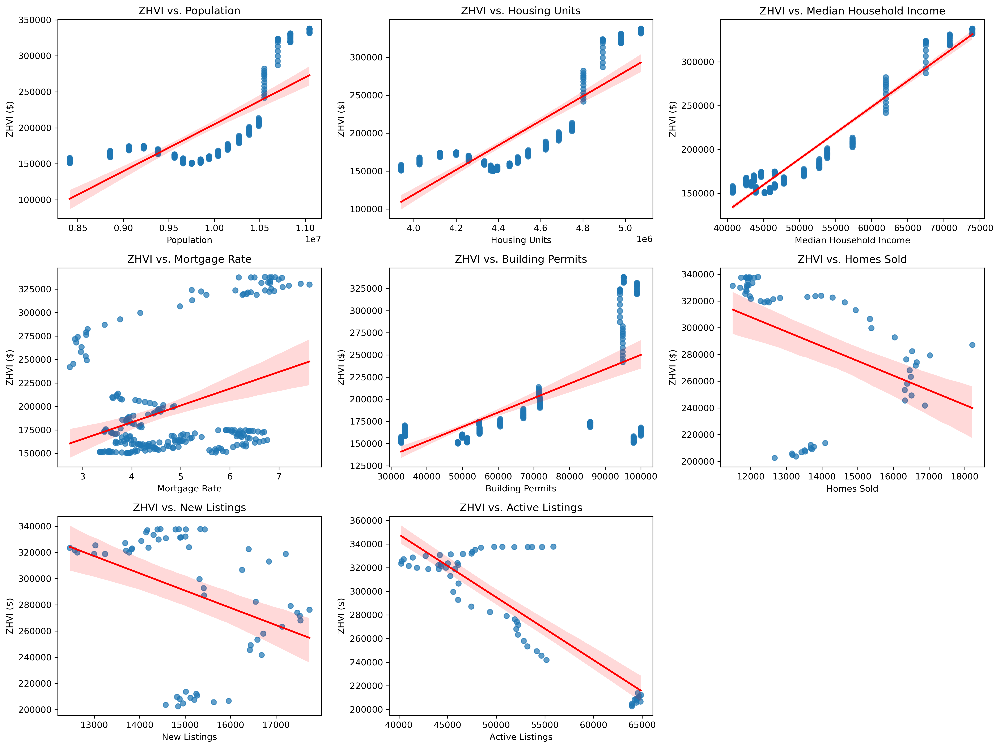
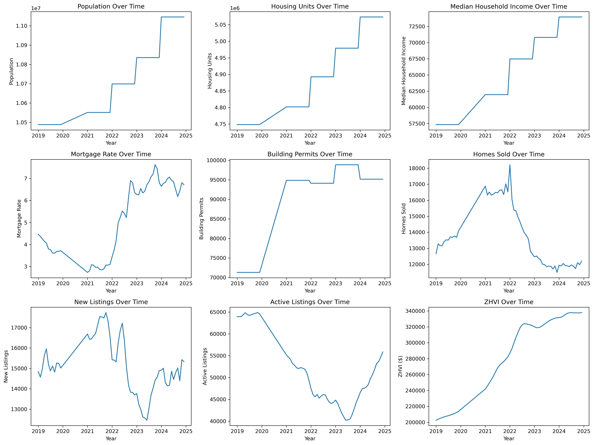
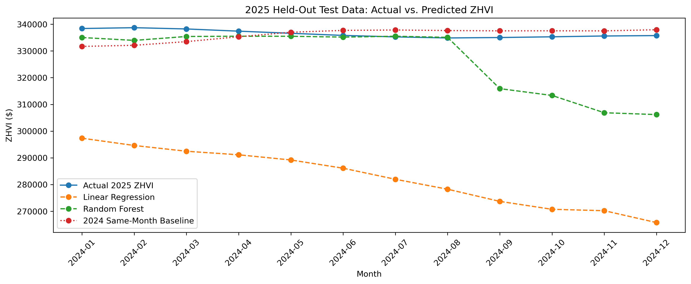
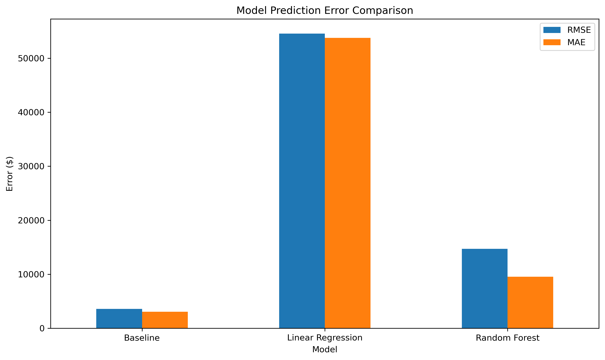

## Project 2 — Is it Possible to Predict North Carolina's Housing Market?

---

## What's the Problem

From the beginning, when the world formed, the first creature that was not a single-celled organism roamed the sea. Living in its world, its home, some find it or even have to make it, and that idea has not changed for land-bound creatures as well. Finding shelter from the elements, from prey, from any danger that surrounds them. A home is a place many desire to have. From the first man who crafted his home from mud and sticks when he thought a cave or under a tree was not enough, to building structures of mass with stone in the ancient world, and now to the modern era of concrete, metal, and more. But none came free; none came without waste or trade, and so a deal had to be made. 

The homes we live in, newly built or not, passed down from the past generation or not, all came at a cost, and it was either the ones before us or we who had to pay the price, but price is not something that has a limit to it. It changes, and change is caused by a great many reasons. The reasons for change can be measured; they can be assumed, or even made up to create an illusion that makes it easier to understand a change. Now, in this project, it will answer whether machine learning can help address a problem, but not really a problem, but more of an inquiry. “How will housing market prices in North Carolina change in the next year?” Who would not want to know how much housing costs? When to buy, when to sell. Helping buyers and realtors make decisions on the value of a home- not the memories, but the money.

This project will specifically look at the housing market in North Carolina and will use variables such as active listings, building permits, homes sold, housing units, median household income, mortgage rate, new listings, and population. All these variables will help determine/predict the Zillow Home Value Index (ZHVI) of North Carolina in 2025. 

---

## Data Description

The data used in this project come from several reliable sources, including the U.S. Census Bureau, Zillow, Freddie Mac, and the U.S. Bureau of Labor Statistics. These sources collect data that can help explain changes in the housing market. The U.S. Census Bureau provides information such as population, number of housing units, and median household income. The Census Bureau also provides building permit data, which shows the number of new homes that are approved to be built. Zillow provides housing price data that can be used to see how home prices have changed over time. Freddie Mac provides mortgage rate data, which can help show how borrowing costs can affect housing prices. The Bureau of Labor Statistics provides unemployment data that can also help explain changes in the economy and housing market.

These variables provide important information that can be used to answer the research question, “How will the housing market in North Carolina change in the next year?” By looking at past housing prices and other factors such as population, income, housing units, and mortgage rates, the project can find patterns that may help predict future housing prices. However, there are some weaknesses in the data. Housing prices can be affected by many things that are not included in the project, such as changes in the economy, interest rates, and buyer behavior. Because of this, the model can only provide an estimate of what may happen to the housing market and cannot guarantee what will happen.

---

## Data Cleaning and Preparation

When it came to starting this project, I was gonna need many variables, and handling them was a task. Collecting them was a task, but in the end I had them; it came down to how to proceed. Most of the data was downloaded as a CSV, meaning I could look at each CSV file and see what was missing, what was matched, what was not, and what was useful to help further this project along. Before discussing the next step, I should say that the sources of these datasets are potentially trustworthy sources of information; no one can say 100% that something is credible, but it is reasonable to trust that these organizations that provided such data are trustworthy sources of information to be used.  

When it came to cleaning the data, it was only a bit of a nuisance because the 2020 data conflicted with the data, as many things caused problems due to the lack of data. COVID was a problem, leaving many missed and uncollected data. So, in relation to this project, 2020 data had to be omitted from the final dataset that would be created with all necessary data from all variables and from the time period they are from.

With that information handled, moving on to each dataset. Each collected source contained a full set for the United States, so there would be no need to collect only North Carolina data to help answer the research question. After collecting each variable within each dataset for a specific, tailored time period, which was from 2005 to 2024, excluding 2020, I could finally create a whole dataset for this project with its specific features.

However, it was not done because, looking at the CSV files, there was one that did not hold data going back as far as 2005, but only to 2019. So, a decision had to be made. Omit this CSV file with its variables because it did not have data starting from 2005, or only use data from all files starting from 2019. I chose to keep the file, include it in the final dataset, and start from 2019. The decision came from the thought that modern data would be more effective than stretching back to historical data, because looking at the closer economic standing with the present would provide a more accurate prediction.

---

## Findings

---
## Graphs

## Correlation Heatmap & OLS

The OLS model using 2019–2024 data explained 98.3% of the variation in North Carolina ZHVI (R-squared = 0.983). Population, housing units, median household income, building permits, and new listings were statistically significant predictors at the 5% level or below. Mortgage Rate, Homes Sold, and Active Listings were not significant, as they were above the 5% level. The correlation heatmap provides additional context by showing the relationships between ZHVI and the recent market variables, as well as the relationships among the predictors themselves. The strong correlations shown in the heatmap help explain the high overall R-squared of the OLS model, while correlations among the predictor variables may also contribute to differences between the simple relationships shown in the heatmap and the individual OLS coefficients. Although the OLS model has a very high R-squared, the low Durbin-Watson statistic (0.642) indicates positive autocorrelation in the residuals, which is important because the data are monthly time series, and so the data will follow closely with their closer relationships.

## Scatter Regression Trend

What can be said is that each scatter plot shows the relationship between each variable and the target variable, ZHVI. These graphs show that as North Carolina has grown, housing prices have also gone up. Population, housing units, and household income all move upward with housing prices, while things like homes sold, new listings, and active listings move downward. This shows that even though there are changes in the housing market, the price of homes has continued to rise.

## Market Trends

These graphs show how much the North Carolina housing market has changed from 2019 to 2025. The population, number of housing units, and household income have all increased, while homes sold and the number of homes available have generally gone down. At the same time, housing prices continued to rise, showing that homes have become more expensive even while some parts of the housing market have slowed down or taken dips.

## Training and Testing

During the training phase, all collected variables were used, along with additional information that can help explain changes in housing prices. When it comes to buying and selling in economic terms, you can’t just look at numbers, but shifts—shifts in the year, the season, and what happened before. Housing prices are not just affected or mainly decided by median household income, building permits, or mortgage rates. Like how certain products can cost different prices during different times of the year, the same can be true for houses. Because of this, the training included information from the same month of the previous year, since what happened before can give an idea of where prices may move in the future. The time of year was also considered because the housing market does not always behave the same way throughout the year. The models were trained using information from 2019, 2021, 2022, and 2023, while 2024 was kept separate for testing to see whether the patterns learned from the past could help predict housing prices for 2025.

The results show that both models were able to learn the patterns found in the housing market during the training period. The Random Forest performed slightly better than the Linear Regression model, with an R-squared of 0.998 compared to 0.994, meaning both models were able to explain almost all of the variation in the training data. This suggests that the information from previous years, changes throughout the year, and the economic variables together gave the models a strong understanding of how housing prices had been moving. However, learning from the past is not the same as knowing the future. The models were given the information from 2024 and asked to predict what 2025 values could be, and they gave their predictions based on what they learned. 

 Linear Regression predicted that housing prices would continue increasing throughout 2025, reaching around $363,000–$367,000, while Random Forest predicted a much lower path, beginning around $334,000 and falling to around $317,000 by December. This difference shows why the testing stage is important. Both models learned from the past, but don’t tell or predict the same story. This means the model that performs best on the training data is not truly the model that will make the best prediction, for you will only know which is best when compared with real, actual true data. And now, the actual 2025 housing prices can be used to see which model's story is closer to what really happened.

## Actual VS Prediction

## Finale

## Limitations and Reflection

## References

U.S. Census Bureau. (n.d.). American Community Survey data via API. U.S. Department of Commerce. Retrieved September 29, 2026. Census ACS API

U.S. Census Bureau. (n.d.). Building Permits Survey. U.S. Department of Commerce. Retrieved September 29, 2026. Census Building Permits Survey

Zillow Economic Research. (n.d.). Housing data. Zillow. Retrieved September 29, 2026. Zillow housing data 

Freddie Mac. (n.d.). 30-year fixed rate mortgage average in the United States [MORTGAGE30US]. FRED, Federal Reserve Bank of St. Louis. Retrieved September 29, 2026. FRED MORTGAGE30US series 

U.S. Bureau of Labor Statistics. (n.d.). Local Area Unemployment Statistics. U.S. Department of Labor. Retrieved September 29, 2026. BLS Local Area Unemployment Statistics 

Redfin. (n.d.). Redfin Data Center. Retrieved September 29, 2026. Redfin Data Center 

AI DISCLAIMER: ChatGPT and Google's AI assistant were used to retrieve variables that I struggled to access on my computer, as well as to find information on linear regression and random forest trees (No prior knowledge/very little). They were also used to help troubleshoot problems, as well as to provide details that could be added to help with visuals, data cleaning, etc. 

