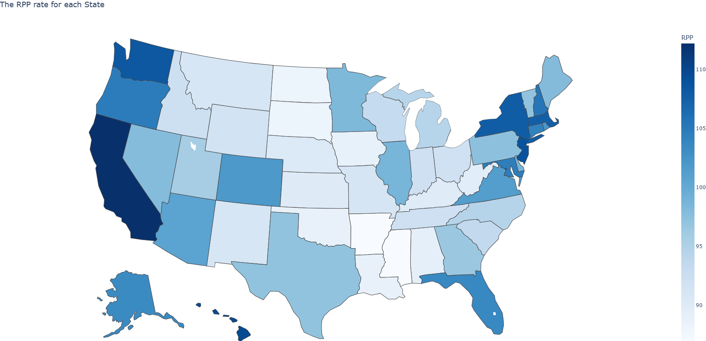
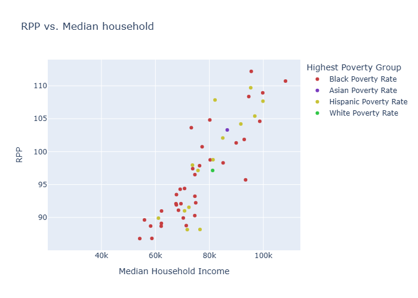
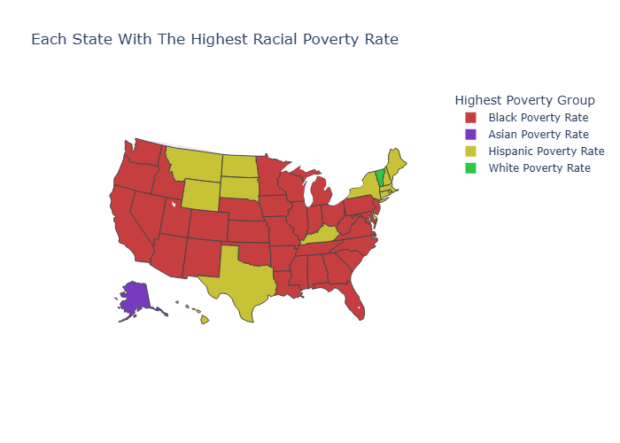
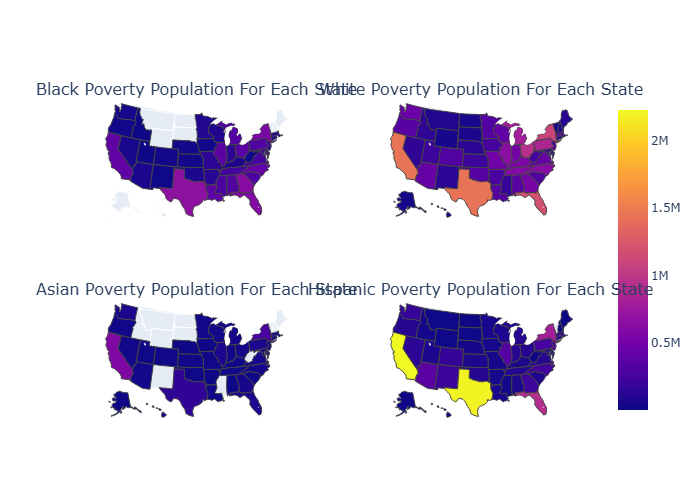
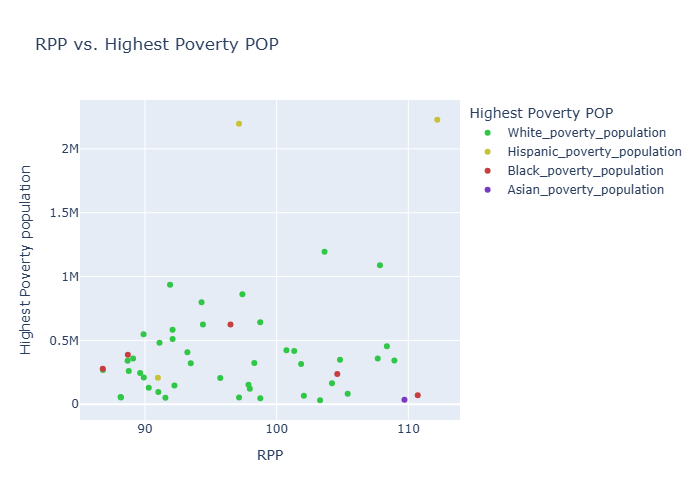
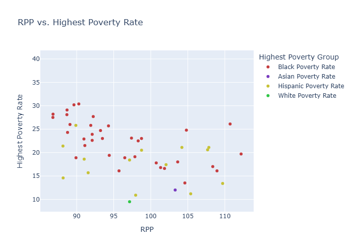
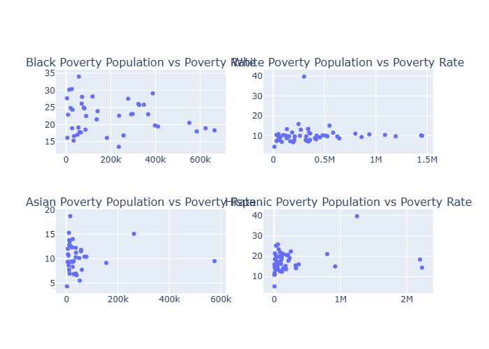

# My Projects

---

## Project 1 — U.S. Poverty Analysis

---

## Research Question: Does the state's cost of living in the US relate to the poverty rate of different racial groups, and which states affect certain groups the most?

---

## What's The Problem
Around the world, there are many problems: the lack of certain necessities. Food, water, resources, money, and a plethora of other items that can sustain a person, family, or racial group. To a point, every single country deals with this problem, and to say none do is a lie. The problem of poverty: instead of looking at the whole world in this project, it will look at the country with the greatest wealth and the greatest debt: the United States of America. The US may have some of the wealthiest people with full pockets or just enough, but there are many with empty pockets, just specks of dust in them, or just scraping by. Poverty is a problem that can affect anyone; it can take anyone and bring them lower, as it's not Cinderella's glass slipper- white, black, asian, or Hispanic; it's a problem all racial groups deal with. Some more than others, but it's there; it exists, and it's a problem in America.
But you may ask: how is there such a thing as poverty? Why are so many living in such poor conditions while others are doing just fine? There are many factors that could cause such an outcome, but this project will look into the relationship between poverty among different racial groups and the cost of living.

---

## Data Description
The data used in this project comes from the U.S. Census Bureau and the U.S. Bureau of Economic Analysis. Both conduct their own data collection from those willing to provide their data and information, and they also conduct their own research to obtain it. From the U.S. Census Bureau, variables such as total population size and the total population size in poverty of different racial groups are collected from each state in the U.S. Not only is there data on population size, but also median household income and RPP. What is RPP, you may ask? Well, it stands for Regional Price Parities, and it is used to measure the change in prices for states relative to the national average. The national average is 100 RPP, and you can either be above it or below it; it is used by many researchers to study regional cost-of-living differences, poverty rates, and real personal income. Both data sets contain a total of 11 variables for the project to use, but even with so little, they contain important information about the poverty present in the U.S. during 2023 that can be used to help answer the research question asked. However, even with this data, there are always weaknesses such as biases, missing information, and the lack of reliability of the data that can sway the conclusion of the project.

---

## Data Cleaning and Preparation
First off, there was not much that needed to be done, as it came from the U.S. Bureau; the data are clean and set up to be used by those who are planning to use them. The only real cleaning or preparation actions that had to be done were retrieving the variables, accounting for missing data, and turning strings that look like numbers into numbers or integers if they were to be used as numbers. There was no need to omit or delete rows or columns because the variables could be trusted and would be used. However, this did not mean I omitted a variable/column, as before I had native american variables, but looking through they population was far below the rest, and keeping them would skew the results more than the other variables likely would. Though without them, it does take away from the research, as there is less to ponder about which racial group is more affected by the cost of living. 

---

### Interactive Graphs

### RPP Map

[View Interactive RPP Map](../graphs/RPP.html)

To start, creating a map of the U.S. with each state's RPP helps create an image of how each state's RPP differs from the others. Seeing the spread of the RPP (a measure of the cost of living) for each state helps give an idea of the cost of living in each state, and what can be seen is that major areas like California, New York, and New Jersey have higher RPP values. To note, RPP accounts for the average change in the cost of goods and services as one, meaning it includes housing costs, insurance, groceries, and many other costs. So one cost might have a bigger change than another, but they are put into the state's RPP to create the average change in cost of living to the national average. There are many factors that go into the cost of living, and RPP is the general average to see that change. It may not be fully accurate, but it's simpler to see and involve in research.

---
### RPP vs. Household Income

[View Interactive Graph](../graphs/RPP_vs_Household_income.html)

To find the relationship between RPP and Median Household Income, I created a scatter plot not only to show the relationship but also to see which racial group correlates with it. The findings were expected and realistic. As the cost of living increases, the general median household income would also increase, and the most affected by the cost of living is the black community. Comparing the number of visible red dots to the rest of the ethnic communities, the black community is seen much more commonly on the graph, as they are the most dominant. At the highest point on the graph is California, with an RPP of 112 and a median household income of 95k; the black community has a higher poverty rate compared to the other communities. But not just the highest; Mississippi also has the lowest RPP and median household income, 86 and 54k. Even at the lowest RPP, meaning there are the cheapest goods and services, those in the black community are experiencing the most poverty.

---
### Highest Poverty Group by State

[View Interactive Graph](../graphs/highest_poverty_group.html)

This map dispalys the whole of the United States and shows which state expeirnces the highest racial poverty of a certian group.

---
### Poverty Population by Population Group

[View Interactive Graph](../graphs/poverty_population.html)

---

### Highest Poverty Population by State

[View Interactive Graph](../graphs/highest_poverty_population.html)

---

### RPP vs. Highest Poverty Population

[View Interactive Graph](../graphs/RPP_vs_highest_population.html)

---
### RPP vs. Highest Poverty Rate

[View Interactive Graph](../graphs/RPP_vs_highest_rate.html)

---
### Population vs. Poverty Rate

[View Interactive Graph](../graphs/population_vs_rate.html)

---
## Code
[View the Python Code](../Project01.ipynb)

## References

Worldometer. (2024). GDP by country. https://www.worldometers.info/gdp/gdp-by-country/

World Population Review. (n.d.). Countries by national debt. https://worldpopulationreview.com/country-rankings/countries-by-national-debt

U.S. Census Bureau. (2023). American Community Survey 1-year data [Data set]. https://api.census.gov/data/2023/acs/acs1

U.S. Bureau of Economic Analysis. (2023). Regional price parities by state [Data set]. https://apps.bea.gov/api/data/

Plotly. (n.d.). Choropleth maps in Python. https://plotly.com/python/choropleth-maps/

AI DISCLAIMER: Chatgpt and Google's AI assistant were used in the aid of retrieving variables that I struggled to access on my computer as well as find information on choropleth graphs (No prior knowledge). It was also used to help troubleshoot problems, as well as provide details that could be added to help with visuals. 
