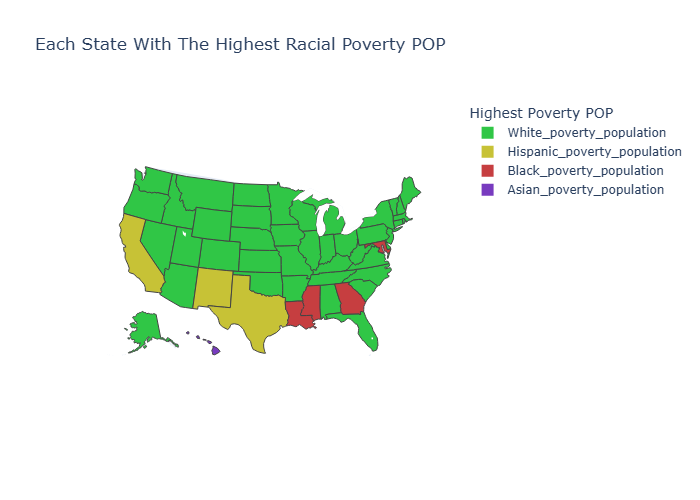

# My Projects

---

## Project 1 — U.S. Poverty Analysis

---

## Research Question: Does the state's cost of living in the US relate to the poverty rate of different racial groups, and which states affect certain groups the most?

---

## What's The Problem
Around the world, there are many problems: the lack of certain necessities. Food, water, resources, money, and a plethora of other items that can sustain a person, family, or racial group. To a point, every single country deals with this problem, and to say none do is a lie. The problem of poverty: instead of looking at the whole world in this project, it will look at the country with the greatest wealth and the greatest debt: the United States of America. The US may have some of the wealthiest people with full pockets or just enough, but there are many with empty pockets, just specks of dust in them, or just scraping by. Poverty is a problem that can affect anyone; it can take anyone and bring them lower, as it's not Cinderella's glass slipper- white, black, asian, or Hispanic; it's a problem all racial groups deal with. Some more than others, but it's there; it exists, and it's a problem in America.
But you may ask: how is there such a thing as poverty? Why are so many living in such poor conditions while others are doing just fine? There are many factors that could cause such an outcome, but this project will look into the relationship between poverty among different racial groups and the cost of living.

---

## Data Description
The data used in this project comes from the U.S. Census Bureau and the U.S. Bureau of Economic Analysis. Both conduct their own data collection from those willing to provide their data and information, and they also conduct their own research to obtain it. From the U.S. Census Bureau, variables such as total population size and the total population size in poverty of different racial groups are collected from each state in the U.S. Not only is there data on population size, but also median household income and RPP. What is RPP, you may ask? Well, it stands for Regional Price Parities, and it is used to measure the change in prices for states relative to the national average. The national average is 100 RPP, and you can either be above it or below it; it is used by many researchers to study regional cost-of-living differences, poverty rates, and real personal income. Both data sets contain a total of 11 variables for the project to use, but even with so little, they contain important information about the poverty present in the U.S. during 2023 that can be used to help answer the research question asked. However, even with this data, there are always weaknesses such as biases, missing information, and the lack of reliability of the data that can sway the conclusion of the project.

---

## Data Cleaning and Preparation
First off, there was not much that needed to be done, as it came from the U.S. Bureau; the data are clean and set up to be used by those who are planning to use them. The only real cleaning or preparation actions that had to be done were retrieving the variables, accounting for missing data, and turning strings that look like numbers into numbers or integers if they were to be used as numbers. There was no need to omit or delete rows or columns because the variables could be trusted and would be used. However, this did not mean I omitted a variable/column, as before I had native american variables, but looking through they population was far below the rest, and keeping them would skew the results more than the other variables likely would. Though without them, it does take away from the research, as there is less to ponder about which racial group is more affected by the cost of living. 

---

### Interactive Graphs

### RPP Map

[View Interactive RPP Map](../graphs/RPP.html)

To start, creating a map of the U.S. with each state's RPP helps create an image of how each state's RPP differs from the others. Seeing the spread of the RPP (a measure of the cost of living) for each state helps give an idea of the cost of living in each state, and what can be seen is that major areas like California, New York, and New Jersey have higher RPP values. To note, RPP accounts for the average change in the cost of goods and services as one, meaning it includes housing costs, insurance, groceries, and many other costs. So one cost might have a bigger change than another, but they are put into the state's RPP to create the average change in cost of living to the national average. There are many factors that go into the cost of living, and RPP is the general average to see that change. It may not be fully accurate, but it's simpler to see and involve in research.

---
### RPP vs. Household Income

[View Interactive Graph](../graphs/RPP_vs_Household_income.html)

To find the relationship between RPP and Median Household Income, I created a scatter plot not only to show the relationship but also to see which racial group correlates with it. The findings were expected and realistic. As the cost of living increases, the general median household income would also increase, and the most affected by the cost of living is the black community. Comparing the number of visible red dots to the rest of the ethnic communities, the black community is seen much more commonly on the graph, as they are the most dominant. At the highest point on the graph is California, with an RPP of 112 and a median household income of 95k; the black community has a higher poverty rate compared to the other communities. But not just the highest; Mississippi also has the lowest RPP and median household income, 86 and 54k. Even at the lowest RPP, meaning there are the cheapest goods and services, those in the black community are experiencing the most poverty.

---
### Highest Poverty Group by State

[View Interactive Graph](../graphs/highest_poverty_group.html)

This map displays every state in the United States, and each state is colored based on which racial group has the highest rate of poverty. Based on the graph, there is a clear answer to the research question: the black racial group experiences a higher rate of poverty in relation to the cost of living. Compared with the RPP graph, the black racial poverty rate is the highest compared to the white, asian, and Hispanic poverty rates. No matter whether it has the highest RPP or the lowest, throughout the entire region of the US north, east, south, or west the black comminity is the majority of the poverty.

---

### Highest Poverty Population by State

[View Interactive Graph](../graphs/highest_poverty_population.html)

This map displays every state in the United States, and each state is colored based on which racial group has the highest population in poverty. A major turnaround compared to the previous graph, the white racial group is actually facing a higher number of individuals in poverty. For information that is known or not on where certain ethnic groups choose to live, many white racial groups tend to stick to the northern and Midwestern regions, while the black racial groups tend to live in the southern regions, with Hispanics in the Southwest, and Asians in coastal states. Based on the information displayed in this map, it follows that trend pretty accurately, and it suggests that the majority in poverty is the white community, with the knowledge that the black community has a smaller population compared to the white and Hispanic communities but still has a fair-sized number in poverty to cause such high rates; since the white community has such a big total population size, their rate would be drawn lower.

---
## Finale
During my research and data visualization, I identified ideas and results to interpret. First, to answer the research question, "Does the state's cost of living in the US relate to the poverty rate of different racial groups, and which states affect certain groups the most?" I can firmly say it does not have a direct effect on which racial group is more affected than another by a state's cost of living (RPP). Second, when it comes to racial groups, it's more of a historical influence and modern influences, as well as the regions in which racial groups live. To say again, in which regions racial groups live, such as Hispanics and blacks, will see a higher rate of poverty even if the cost of living is high or low, as there are many factors to keep in mind: racial biases that influence wages, employment, and other factors that pose ways to make a living. Third, to conclude between rate and population, the rate has the majority of the black community, with Hispanics close behind, while the population has the majority of the white community, as they are the largest group of individuals in poverty.
Back on track, the answer is that the cost of living does not have a direct effect on the disparity of a certain racial group in a state, but it can push poverty rates to increase further for certain groups like the black and Hispanic communities. The high cost of living does not create the gap between racial groups. Instead, it acts like a magnifier, multiplying the rate. It makes existing problems much worse for vulnerable communities.

---
## Limitations and Reflection
During and after completing this project, there was room for improvement. There could be more additions to the project, more detail, and more factors and variables that could be included, but given the scope, I completed the work on time and efficiently with what I had. Given more time, the possibility to further dive into the work to include more data, variables such as immigration, racial biases, regional data, and further expand the idea of cost of living in its specific aspects, this project could be narrower or more detailed than the final product in its current state. While creating the visualizations for the project, I could see many skews and nulls in the data. As data can be missing for certain groups, it can lead to wrong outcomes that are not faults of the data but of the collection of it. To note, biases are in play: some may choose not to answer questions that they may find too personal, be easily offended by, or prefer not to admit, as it could be a shame. Another bias is that some may not be reachable, as some live without access to this survey due to a lack of technology or communication, or the region or geography they live in. Biases are a problem with data, as they can affect and skew outcomes, and these biases are evident, as it is understandable that some may not want to admit they are living a hard life. The research question and its outcome did not meet my expectations, but there is room for improvement. Looking back on it, a broad topic, a question with too much behind it, and a lot of information and detail to uncover, but not impossible to pinpoint. Poverty is a major problem in this country and not just this country; it's a problem everywhere, and it's worth putting research into, as people should not be living in disparity because of the color of their skin or the background they associate with, and the power of money has put so many in financial and physical trouble.

## Code
[View the Python Code](../Project01.ipynb)

## References

U.S. Census Bureau. (2023). American Community Survey 1-year data [Data set]. https://api.census.gov/data/2023/acs/acs1

U.S. Bureau of Economic Analysis. (2023). Regional price parities by state [Data set]. https://apps.bea.gov/api/data/

Plotly. (n.d.). Choropleth maps in Python. https://plotly.com/python/choropleth-maps/

Plotly. (n.d.). Line and scatter plots. https://plotly.com/python/line-and-scatter/

AI DISCLAIMER: Chatgpt and Google's AI assistant were used in the aid of retrieving variables that I struggled to access on my computer as well as find information on choropleth graphs (No prior knowledge). It was also used to help troubleshoot problems, as well as provide details that could be added to help with visuals. 
