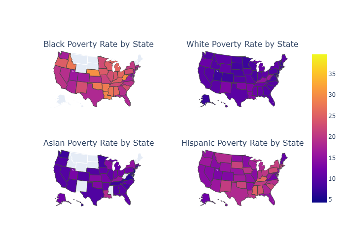

# My Projects

## Project 1 — U.S. Poverty Analysis

## Research Question:
Does the state's cost of living in the US relate to the poverty rate of different racial groups, and which states affect certain groups the most?

### Interactive Graphs

### RPP Map

[View Interactive RPP Map](../graphs/RPP.html)

---
### RPP vs. Household Income

[View Interactive Graph](../graphs/RPP_vs_Household_income.html)

---
### Highest Poverty Group by State

[View Interactive Graph](../graphs/highest_poverty_group.html)

---
### RPP vs. Highest Poverty Population

[View Interactive Graph](../graphs/RPP_vs_highest_population.html)

---
### RPP vs. Highest Poverty Rate

[View Interactive Graph](../graphs/RPP_vs_highest_rate.html)

---
### Poverty Population by Population Group

[View Interactive Graph](../graphs/poverty_population.html)

---
### Poverty Rates by Population Group

[View Interactive Graph](../graphs/poverty_rates.html)

---
### Population vs. Poverty Rate

[View Interactive Graph](../graphs/population_vs_rate.html)

---
## Code
[View the Python Code](../Project01.ipynb)

## References
U.S. Census Bureau. (2023). American Community Survey 1-year data [Data set]. https://api.census.gov/data/2023/acs/acs1

U.S. Bureau of Economic Analysis. (2023). Regional price parities by state [Data set]. https://apps.bea.gov/api/data/

Plotly. (n.d.). Choropleth maps in Python. https://plotly.com/python/choropleth-maps/

AI DISCLAIMER: Chatgpt and Google's AI assistant were used in the aid of retrieving variables that I struggled to access on my computer as well as find information on choropleth graphs (No prior knowledge). It was also used to help troubleshoot problems, as well as provide details that could be added to help with visuals. 
